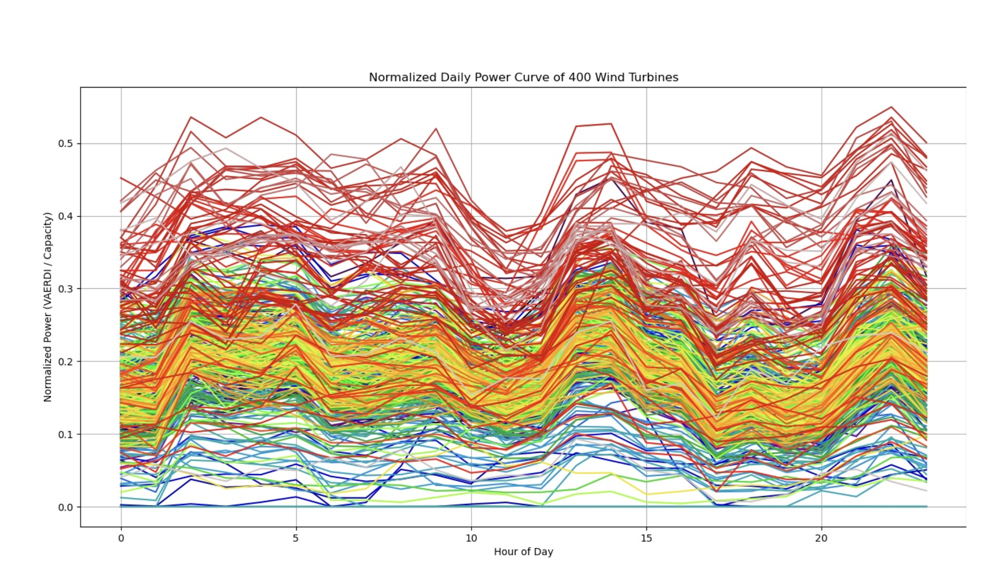
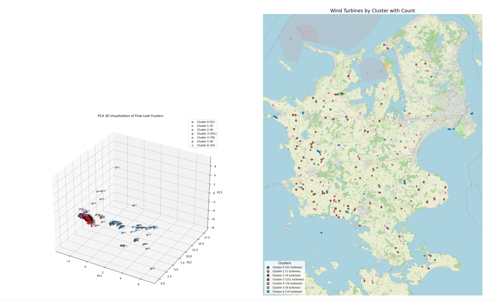
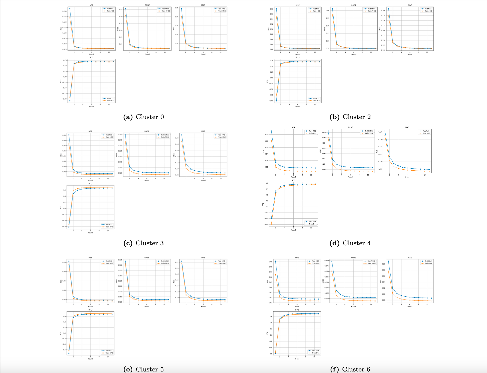
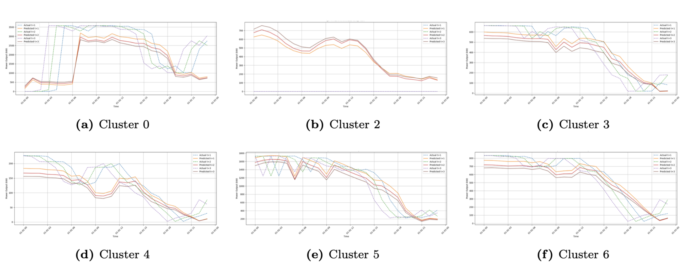

# Behaviour-Aware Federated Wind Power Forecasting System

This repository designed and implemented a behavior-aware federated learning pipeline for large-scale, heterogeneous time-series forecasting:  

- Designed and implemented a behavior-aware federated learning framework for short-term power forecasting across 400+ independent wind turbines.

- Designed and implemented a custom auto-split strategy for federated clustering, enabling recursive refinement of heterogeneous client groups based on silhouette scores and minimum cluster-size constraints.

- Trained cluster-specific federated LSTM models for multi-step  time-series forecasting, enabling 24-hour rolling predictions at turbine level.

- Built an end-to-end experimental pipeline including data preprocessing, feature engineering, model training, evaluation, and data visualization.

- Compared federated approaches against centralized and non-hierarchical baselines,demonstrating improved stability and accuracy under heterogeneous data conditions.


---

## 1. Overview

### Real-world energy data

- Built on real-world utility datasets combining settlement metering data, wind turbine turbine data, and numerical weather prediction forecasts.
- Each turbine has ≈ **8,760 hourly samples** in 2019 (24 hours × 365 days).



### Behaviour-aware turbine clustering

- From each turbine’s annual power series, the following behaviour features are computed:
  - `mean_power`, `std_power`, `cv`
  - `zero_ratio`
  - `ramp_mean`, `ramp_std`
- These form a compact **“behaviour fingerprint”** describing:
  - long-term level (mean),
  - relative variability (std, cv),
  - downtime behaviour (zero_ratio),
  - ramping dynamics (ramp_mean, ramp_std).
- Implemented methods:
  - **Federated K-Means** with **Double Roulette Selection (DRS)** initialisation
  - **Recursive Auto-split** based on silhouette scores and minimum-size constraints  
- Only local statistics are shared – **no raw time series leaves the turbine/client**.

### Cluster-specific federated LSTM forecasting

- Each turbine acts as a logical **client**;
- Built on top of **[Flower](https://flower.dev/)**;
- Model: **LSTM + MLP head** for **3-step-ahead** active power regression.
- Input features per time step:
  - **Meteorological**: `wind_speed`, `wind_dir_sin`, `wind_dir_cos`, `temperature_c`
  - **Temporal encodings**: `hour_sin`, `hour_cos`
  - **Static turbine features**: `Capacity_kw`, `age`
  - **Autoregressive history**: past 24 hours of `power_output` 


### Different strategies comparison

- Federated baselines with different grouping strategies:
  - **DRS-auto** (behaviour clustering + recursive split)
  - **KMeans++-auto** 
  - **Non-autoSplit Fed-KMeans** (one-layer behaviour clusters)
  - **Geo-3 / Geo-7** (purely geographic K-Means)
- On a representative cluster (51 turbines), a **centralised LSTM** is trained on pooled data as an **upper bound**. This allows direct comparison between:
  - **centralised training**: best performance, requires moving all data
  - **federated training**: better privacy / communication, slightly lower accuracy

---

## 2. Repository structure

```text
├── clustering/
│   ├── data_process_and_select/     # Data filtering, feature construction 
│   ├── auto_split/                  # Behaviour-aware federated KMeans with recursive split
│   │   ├── cluster_tree_utils.py           # Double Roulette init, recursive split, silhouette filtering
│   │   ├── cluster_tree_kmeans_utils.py    # KMeans++ init variant
│   │   ├── plot.py                         # PCA visualisations, leaf label extraction
│   │   ├── federated_recursive_grid_main.py
│   │   │                                    # Main entry: load features + coords, grid-search parameters,
│   │   │                                    # save tree structure and visualisations
│   │   ├── 400 turbines/                    # Inputs / intermediates for 400-turbine auto-split
│   │   ├── 400 turbines_kmeans++/           # KMeans++ init auto-split results
│   │   └── group results/analysis           # Final cluster trees, stats, PCA plots
│   ├── non-autosplit/               # Plain KMeans baselines + elbow/silhouette, PCA plots
│   ├── geo-cluster/                 # Geo-based KMeans (3/7 clusters) and evaluation scripts
│   ├── archive/                     # Older experiments / alternative clustering ideas
│   └── environment.yml              # Conda env for clustering
│
├── prediction/
│   ├── dataset/                     # Raw / processed datasets
│   ├── ml/
│   │   ├── models/                  # MLP / RNN / LSTM / GRU / CNN models
│   │   ├── utils/                   # data_utils (preprocessing, lags, scalers)
│   │   │   
│   │   └── fl/
│   │       ├── server/              # Federated server, FedAvg strategies
│   │       ├── client/              # Abstract client definitions, base training logic
│   │       ├── torch_client.py      # PyTorch regression client (used with Flower)
│   │       └── defaults.py          # Client creation helpers, aggregation weights, configs
│   ├── notebooks/
│   │   ├── 03.Centralized_Training*.ipynb   # Centralised LSTM baselines
│   │   ├── 04.Federated_Training_*.ipynb    # Federated training experiments by grouping strategy
│   │   ├── 09.Make_Predictions_*.ipynb      # Inference & plotting: true vs predicted power
│   │   ├── geo_*/                           # Geo-based FL variants
│   │   ├── kmeans++_init*/                  # KMeans++ init auto-split FL experiments
│   │   ├── non-split*/                      # No-split scenarios (single global client)
│   │   └── model_checkpoint/                # Saved models & scalers
│   ├── metrics/                     # Per-round / per-client metrics (MSE, RMSE, MAE, R², SSE/SST)
│   └── requirements.txt             # Prediction environment


````
## 3. Experimental highlights

### 3.1 Clustering Results

Overall, the clustering in the feature space successfully identifies several distinct op- erational patterns:

- high-output, stable or highly variable turbines (Clusters 0 and 5), which differ mainly in their volatility patterns;
- a large group of mainstream, stable turbines (Cluster 3), representing the “typical” individual turbine behaviour;
- low-output or high-shutdown turbines (Clusters 4 and 1), where Cluster 1 corre- sponds to severely abnormal / faulty units and Cluster 4 to mid-risk, low-output turbines;
- strongly dynamic or mildly unstable turbines (Clusters 2 and 6), which are more challenging from a forecasting perspective due to their ramp and shutdown characteristics.



### 3.2 Federated grouping strategies (all 400 turbines)

**Train set:**

| Method                        | #Clusters | Train MSE    | Train RMSE    | Train MAE    | Train R²    |
|------------------------------|----------:|-------------:|--------------:|-------------:|------------:|
| **DRS-auto**                 | 7         | 0.015690     | **0.122248**  | 0.083851     | 0.688009    |
| **KMeans++-auto**            | 6         | **0.015685** | 0.122333      | **0.083790** | **0.688677**|
| **Non-autoSplit Fed-KMeans** | 6         | 0.015697     | 0.122772      | 0.084284     | 0.686189    |
| **Geo-3**                    | 3         | 0.015950     | 0.123363      | 0.084960     | 0.681493    |
| **Geo-7**                    | 7         | 0.015830     | 0.122923      | 0.084610     | 0.685122    |

**Test set:**

| Method                        | #Clusters | Test MSE      | Test RMSE      | Test MAE      | Test R²      |
|------------------------------|----------:|--------------:|---------------:|--------------:|-------------:|
| **DRS-auto**                 | 7         | **0.017915**  | **0.129725**   | **0.088227**  | 0.699431     |
| **KMeans++-auto**            | 6         | 0.017958      | 0.130001       | 0.088406      | 0.699808     |
| **Non-autoSplit Fed-KMeans** | 6         | 0.017965      | 0.130573       | 0.088881      | **0.714917** |
| **Geo-3**                    | 3         | 0.065451      | 0.142218       | 0.090665      | 0.420789     |
| **Geo-7**                    | 7         | 0.065446      | 0.142135       | 0.090530      | 0.467196     |

- **Behaviour-based grouping (DRS-auto, KMeans++-auto)** clearly outperforms  Non-autoSplit Fed-KMeans, purely geographic grouping (Geo-3/Geo-7) in terms of MSE and R².
- **DRS-auto vs KMeans++-auto**: Almost identical test performance (MSE ≈ 0.018, R² ≈ 0.70). DRS-auto additionally provides a **hierarchical, more balanced cluster tree and  privacy-friendly design**, 
- **Geo-based grouping** is useful as a simple, intuitive baseline, but **not sufficient** for heterogeneous fleets of small, independent wind turbines.



### 3.3 Cluster-wise 24 hours forcasting for each cluster
- **Coloured solid lines**: predicted power at horizons *t+1*, *t+2*, *t+3*.  
- **Coloured dashed lines**: corresponding actual measurements. 




---

## 4. Tech stack

Python, PyTorch, LSTM, Federated Learning, KMeans++, Time-Series Forecasting, Privacy Protection algorithom

---